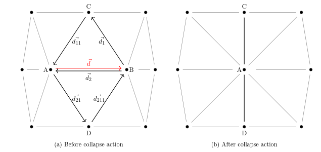
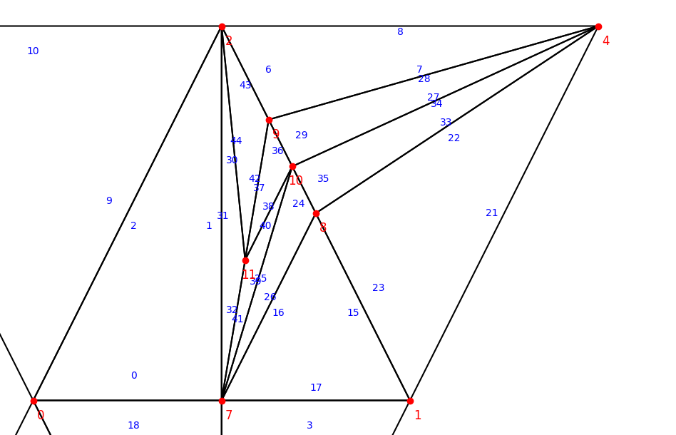
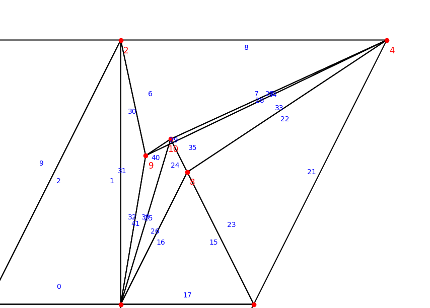
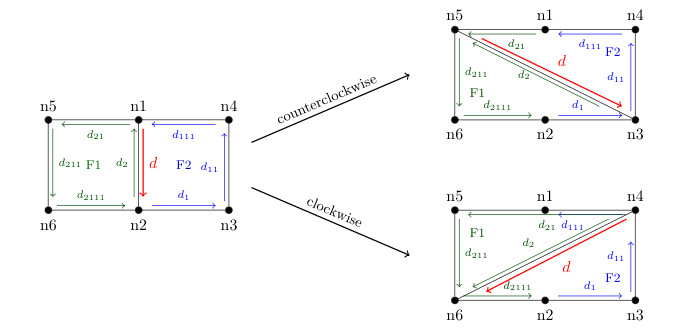
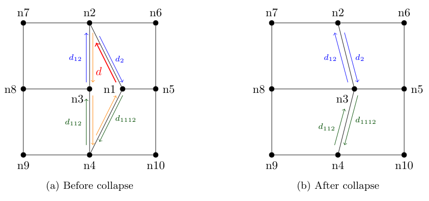

# Triangular Actions

## Flip 

 The **flip** operation flips an inner edge adjacent to two triangles. This selected edge is then deleted and replaced by an edge on the opposite diagonal. The following diagram shows the steps involved in flipping strand d.
 

However, in some configurations, flip action can lead to problematic configurations. That's why we choose to constraint flip action in these situations :

* **Boundary darts :** When a dart is on boundary of the mesh, we should'nt flip the edge. We can check this condition by looking if the dart to flip has a twin dart.
* **Adjacency too high :** When nodes C and D already have an adjacency higher than 10, flip is not possible. 
* **Configuration who tends to imply edge reversal**: To detect these situations, we look a the type of quad formed by the two adjacent faces, i.e. **quad ADBC**.
    * **concave quad:** When the quad is concave, flip operation necessarily lead to an edge reversal. We constraint it.
  In the figures below, we can see when flipping dart 18 a face reversal.
  
  
  

    * **triangular quad:** This configuration should be avoided, as it results in the creation of a degenerate (flat) triangle. As illustrated in the figures below, flipping dart 0 leads to a flattened face between nodes 2, 0, and 7.
  
  
  

**The only configuration we accept is convexe quads**

## Split

 The **split** operation split an inner edge adjacent to two triangles. A node is added in the middle of the edge and two faces are created.

However, in some configurations, split action can also lead to problematic configurations. That's why we choose to constraint split action in these situations :

* **Boundary darts :** When a dart is on boundary of the mesh, we decide to prohibit it. It can be possible if we add another boundary node, but we choose to not touch mesh boundaries. We can check this condition by looking if the dart to split has a twin dart.
* **Adjacency too high :** When nodes C and D already have an adjacency higher than 10, split is not possible. 
* **Configuration who tends to imply null darts**: As other actions are restricted to not allow flat faces, or reversed faces, split action can be performed on each configuration, see figure xxx.

## Collapse

The **collapse** operation deletes an inner edge and also implies the deletion of its two adjacent faces F1 and F2.

However, in some configurations, collapse action can also lead to problematic configurations. That's why we choose to constraint collapse action in these situations :

* **Boundary darts :** When a dart is on boundary of the mesh, we decide to prohibit it. We choose to not touch mesh boundaries. We can check this condition by looking if the dart to split has a twin dart.
* **Adjacency too high :** When nodes A already has an adjacency higher than 10, collapse is not possible. 
* **Configuration who tends to imply edge reversal**: To detect these situations, we look a the type of darts in the surrounding. When there are some darts with concave surrounding, collapse action can lead to edge reversal.

---

# Quadrangular Actions

## Flip 

The **flip** action can be decomposed as follows:

* Check whether the dart `d` exists.  
* Update the **beta1** relations.  
* Update the links from nodes `n1` and `n2`,  if they were previously linked to the flipped dart.  
* Update the links from faces `F1` and `F2`, if they were previously linked to the flipped dart.  
* Update the node links for `d` and `d2`.  
* Update the face links depending on the orientation (darts which change of face):
  * If **counterclockwise**: update links for `d1` and `d21`.  
  * If **clockwise**: update links for `d2111` and `d111`.  
* Update the scores of the nodes.

## Split 

The **split** action can be decomposed as follows:

* Check whether the dart `d` exists.  
* Create a new node **n10** in the middle of [n1,n2]
* Update node links of `d` and `d21`, they are now linked to `n10`
* Create a new face with yellow darts
* Update the **beta2** relations (`d1112`, `d111`,`d212`, `d21`).
* Update the scores of the nodes.

## Collapse 

The **collapse** action can be decomposed as follows:

* Check whether the dart `d` exists.  
* Save the score of node `n1` for later computation.  
* If `n3` is not on the boundary, move its coordinates to the midpoint between `n3` and `n1`.  
* Check if nodes `n2` and `n4` are linked to the dart being deleted. If so, reassign their links to existing darts (node `n3` will be checked later).  
* Delete the face associated with `d`, along with its related darts.  
* Reassign all darts previously linked to `n1` so they now point to `n3`.  
* Link the dart associated with `n3` to an existing node.  
* Update the **beta2** relations (`d2`/`d12`, `d112`/`d1112`).  
* Recalculate the scores of the affected nodes.