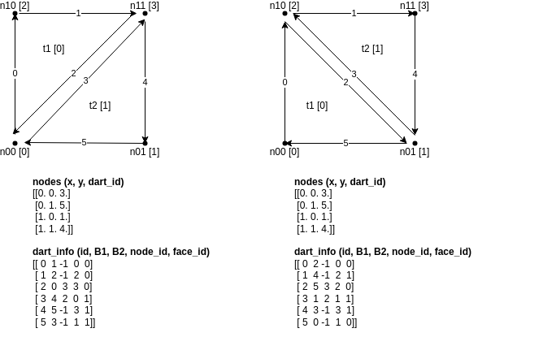
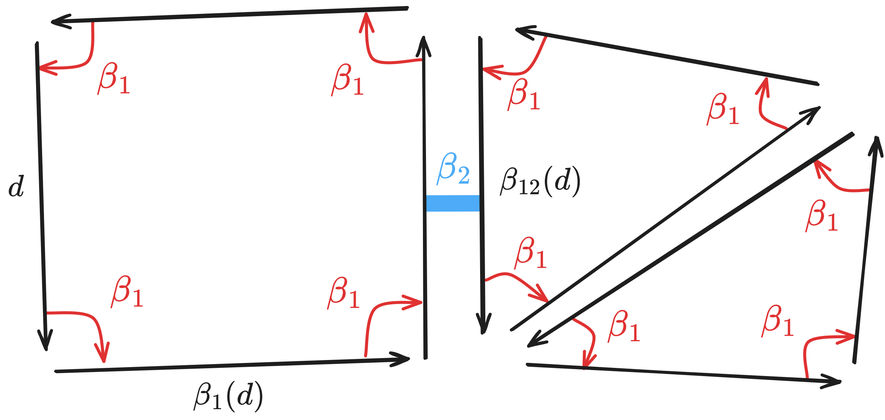

# Combinatorial maps

2-dimensional combinatorial maps, or 2-C-maps for short,  are topological structures that allow us to represent and 
handle 2D oriented manifold surfaces. In order to introduce this model, let us consider
the following picture:
- On the top left, the structure is made of 3 faces, or 2-cells: one quadrilateral, and two triangles
- On the top right, the cells are explicitly named and in particular, we show that faces and nodes are considered.
- In fact, faces are usually defined and built from a set of nodes. Here, for instance, the face *f1* is defined from 
the ordered list of nodes : n1, n6, n5, n2. To have whole well-oriented structure, faces must be oriented in the same 
direction (see bottom left).
- The 2-C-map model is derived from this orientation. For every face, each edge is split and oriented accordingly. On 
the bottom right, we can see those oriented edges (or darts), which are duplicated for edges that are
shared by two faces (inner edges).

The full 2-C-map is depicted below

## Implementation choices 
In order to represent 2D meshes with 2-C-map, we consider a data structue with 2 layers:
- A cellular level that we traditionally handle. We have nodes and faces. Nodes have (x,y) coordinates and a face
is built from an ordered list of nodes.
- A topological level, which is a 2-C-map.

Those 2 levels are interconnected:
1. Each node and each face knows/stores the id of a dart that defines it;
2. Each dart stores the id of the node it starts from and the face it belongs to, plus
the id of the dart reached by beta1 and beta2. 

