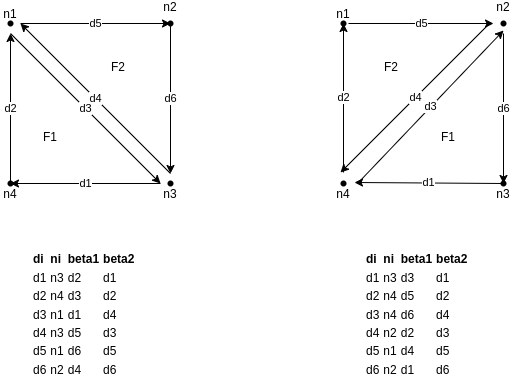

# Design principles

## Incremental game design
In order to learn how to modify a 2D mesh, we first implement a 2D game
that works on pure triangular meshes. Starting from a 2D mesh, the goal 
of the player is to modify the mesh by applying topological operations 
in order to improve the **mesh quality**. Here the quality is defined 
on topological criteria only. More precisely, we consider the degree 
of nodes. The degree of a node is defined as its number of adjacent 
faces. Ideally:
- The degree of an inner node is 6,
- The degree of a boundary node *n* depends on the local geometry 
around *n*.

### Version 1 - Triangles and edge flip
In this first version, we consider a pure triangular mesh, and we have only one 
operation, the *edge flipping*

## CMap design choices
1. Each node and each face knows/stores the id of a dart
2. Each dart stores the id of the node and the face it belongs to, plus
the id of the dart reached by beta1 and beta2. 

