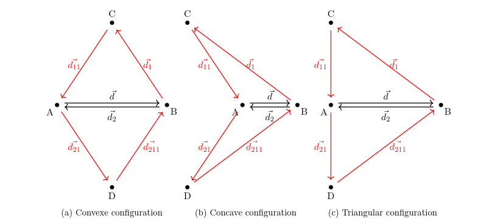
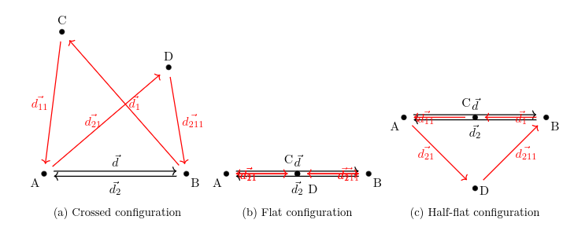

# Observation

## With quality observation

We want to observe the mesh in order to choose an appropriate action to improve mesh regularity.

### Nodes scores

**The first aspect to consider is the nodes scores.**  
A node's score is defined as the difference between its *ideal adjacency* and its *actual adjacency*:

$$
s_n = d_i - d_a
$$

where  $s_n$ is the score of vertex $n$, $d_i$ is its ideal adjacency, and $d_a$ is its actual adjacency.

### Geometrical quality

#### We accept only 3 configurations :

The quadrilaterals shown in Figures (a), (b), and (c) are, respectively, **convex**, **concave**, and **"triangular"**. These configurations are distinguished by the orientation of their internal angles and the behavior of their diagonals.

- A **convex quadrilateral** is characterized by all internal angles being oriented in the *clockwise* direction. Equivalently, for each pair of consecutive edges, the signed cross product is strictly negative in a positively oriented coordinate system. In this case, the two diagonals intersect within the interior of the quadrilateral.

- A **concave quadrilateral** has exactly one internal angle oriented in the *counterclockwise* direction. For instance, in figure (b), this can be expressed as:

  $$
  -\vec{d_{11}} \wedge \vec{d_{21}} > 0
  $$

  In this configuration, the diagonals do not intersect inside the quadrilateral.

- A **"triangular" quadriateral** occurs when two adjacent edges are colinear, that is:

  $$
  -\vec{d_{11}} \wedge \vec{d_{21}} = 0
  $$

#### All other configurations are not supported:

The quadrilaterals shown in Figures (a), (b), and (c) are, respectively, **crossed**, **flat**, and **"half-flat"**. These configurations are also distinguished by the orientation of their internal angles and the cross products.

- A **crossed quadrilateral** is characterized by two internal angles being oriented in the *clockwise* direction and two oriented in the other direction. Equivalently, for each pair of consecutive edges, two signed cross product are strictly negative in a positively oriented coordinate system and two are positive.

- A **flat quadrilateral** is characterized by all cross products null.

  In this configuration, the diagonals do not intersect inside the quadrilateral.

- A **half flat quadriateral** occurs when two adjacent edges of the same triangular face are colinear, that is:

  $$
  -\vec{d_{11}} \wedge \vec{d_{21}} = 0
  $$

#### Conclusion

So we charaterized each dart surrounding by its quad associated as :

| Type              | boundary | convex | concave | triangular | not defined | not supported | 
|-------------------|----------|--------|---------|------------|-------------|------------|
| classification id | -1       | 0      | 1       | 2          | -99         | 3,4,5      |
