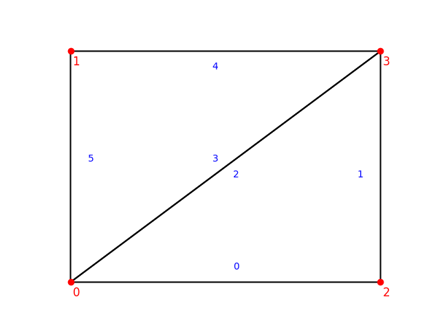
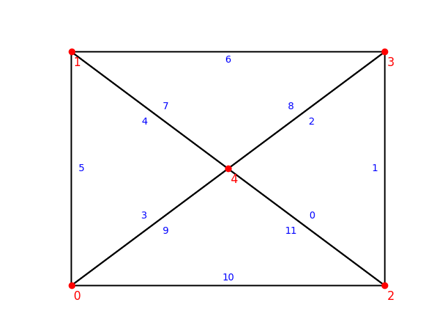
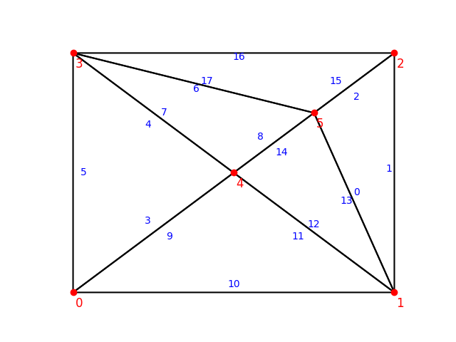
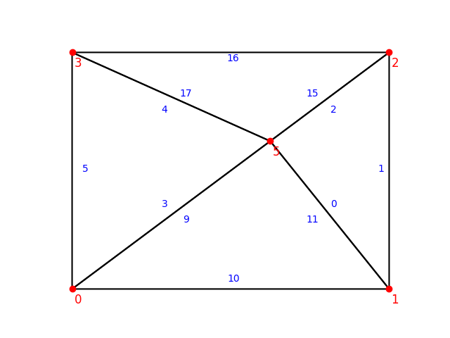

# Actions tests

## Triangular actions

### Flip

We want to ensure that **flip** operations are performed correctly.
Consider the following mesh:

If we flip the dart between nodes **n0** and **n3**, we should obtain the following mesh:

### Split

We want to ensure that **split** operations are performed correctly.
Consider the following mesh:

If we split the dart between nodes **n0** and **n3**, we add a node **n5** on the middle of the edge and two faces are created. 
We should obtain the following mesh:

### Collapse

We want to ensure that **split** operations are performed correctly.
Consider the following mesh:

Here we can't collapse the dart between nodes **n5** and **n2** because n2 is on boundary. However we can collapse the edge between **n4** and **n5**.
We should obtain the following mesh:

